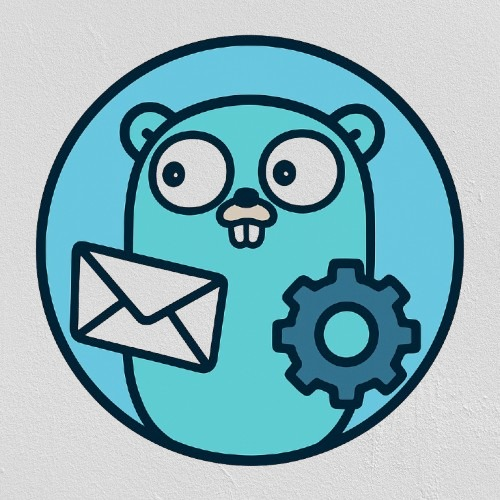

<p align="center">
  
</p>

<h1 align="center">Kabaka</h1>

<p align="center">
  A lightweight, reliable, and efficient asynchronous task queue library for Go.
</p>

<p align="center">
  <a href="https://github.com/weichen-lin/kabaka/releases"></a>
  <a href="https://pkg.go.dev/github.com/weichen-lin/kabaka"></a>
  <a href="https://github.com/weichen-lin/kabaka/actions/workflows/go.yml"></a>
  <a href="https://github.com/weichen-lin/kabaka/blob/main/LICENSE"></a>
</p>

---

Inspired by Kafka, Kabaka is a project designed to provide a simple and high-performance background job processing solution for Go applications. It allows you to offload time-consuming tasks (e.g., sending emails, processing images, generating reports) from your main application flow and execute them asynchronously in the background.

## Core Features

- **Simple API**: Define, dispatch, and execute background jobs with minimal code.
- **High Performance**: Built on Go goroutines, it can process thousands of jobs concurrently, maximizing CPU usage.
- **Reliability**: Includes a built-in retry mechanism for failed jobs.
- **Flexible Configuration**: Customize the number of workers, retry attempts, and more for each topic.
- **Graceful Shutdown**: Waits for currently running jobs to complete before shutting down, ensuring no data is lost.
- **Monitoring**: Provides a simple metrics API to monitor queue status.

## Installation

```bash
go get -u github.com/weichen-lin/kabaka
```

## Usage Example

Here is a simple example of how to define a job handler, create a topic, publish messages, and perform a graceful shutdown.

```go
package main

import (
	"context"
	"fmt"
	"log"
	"os"
	"os/signal"
	"syscall"
	"time"

	"github.com/weichen-lin/kabaka"
)

func main() {
	// 1. Initialize Kabaka
	k := kabaka.NewKabaka()
	log.Println("Kabaka instance created.")

	// 2. Define a task handler
	// This function will be executed by a worker for each message.
	paymentHandler := func(ctx context.Context, msg *kabaka.Message) error {
		log.Printf("💳 Processing payment message ID: %s, Body: %s
", msg.ID, string(msg.Value))

		// Simulate a task that might fail
		if string(msg.Value) == "payment_4" {
			log.Printf("❌ Failed to process payment ID: %s. Simulating an error.
", msg.ID)
			return fmt.Errorf("invalid payment data for message %s", msg.ID)
		}

		time.Sleep(500 * time.Millisecond)
		log.Printf("✅ Successfully processed payment ID: %s
", msg.ID)
		return nil
	}

	// 3. Create a Topic with custom options
	// We're creating a topic with 5 workers and a max of 2 retries.
	err := k.CreateTopic(
		"payment-service",
		paymentHandler,
		kabaka.WithMaxWorkers(5),
		kabaka.WithMaxRetries(2),
	)
	if err != nil {
		log.Fatalf("Failed to create topic: %v", err)
	}
	log.Println("Topic 'payment-service' created with 5 workers.")

	// 4. Publish messages to the topic in a separate goroutine
	go func() {
		for i := 0; i < 10; i++ {
			paymentMsg := fmt.Sprintf("payment_%d", i)
			err := k.Publish("payment-service", []byte(paymentMsg))
			if err != nil {
				log.Printf("Failed to publish to payment-service: %v", err)
			} else {
				log.Printf("Published message to payment-service: %s", paymentMsg)
			}
			time.Sleep(200 * time.Millisecond)
		}
	}()

	// 5. Wait for an interrupt signal to gracefully shut down
	log.Println("Application started. Press Ctrl+C to shut down.")
	quit := make(chan os.Signal, 1)
	signal.Notify(quit, syscall.SIGINT, syscall.SIGTERM)
	<-quit

	// 6. Gracefully shut down Kabaka
	log.Println("Shutting down server...")
	if err := k.Close(); err != nil {
		log.Fatalf("Failed to gracefully shut down Kabaka: %v", err)
	}

	log.Println("Server gracefully stopped.")
}
```

## Core Concepts

- **Message**: The smallest unit of work, containing an ID and a payload (Value) to be processed.
- **Handler**: A function that defines how to process a specific type of Message.
- **Topic**: A named queue that is bound to a Handler. When you publish a message to a Topic, its Workers will execute the corresponding Handler to process the message.
- **Worker**: A goroutine that fetches a Message from a Topic's queue and executes the Handler. You can configure multiple Workers per Topic to process jobs concurrently.

## Contributing

Contributions of all kinds are welcome! Feel free to open a feature request, report a bug, or submit a pull request.

## License

This project is licensed under the [MIT License](LICENSE).