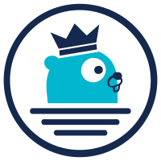

# Kabaka

<p align="center">
  
</p>

**Kabaka** is a high-performance, observable message queue and task distribution system for Go. It features a modern, real-time dashboard for monitoring and managing your message flow with a focus on developer experience and system transparency.

## 🚀 Features

- **Observable Queue**: Real-time monitoring of worker allocation, job status, and success rates.
- **Multi-Broker Support**:
  - **Redis**: For persistent, distributed production workloads.
  - **In-Memory**: For lightning-fast development and testing.
- **JSON Schema Validation**: Built-in validation using JSON Schema for both `struct` and raw JSON payloads.
- **Task Scheduling**: Support for immediate, delayed, and retryable tasks.
- **Modern Dashboard**: A cyber-industrial inspired UI built with React, Framer Motion, and Tailwind CSS.
- **Topic Registry**: Centralized management of topics with ability to pause/resume and purge queues.
- **Developer Friendly**: Simple API with robust options for timeout, retries, and concurrency control.

## 📦 Installation

```bash
go get github.com/weichen-lin/kabaka
```

## ⚡ Quick Start

```go
package main

import (
	"context"
	"fmt"
	"time"

	"github.com/weichen-lin/kabaka"
	"github.com/weichen-lin/kabaka/broker"
	"github.com/weichen-lin/kabaka/dashboard"
)

func main() {
	// 1. Initialize Kabaka
	k := kabaka.NewKabaka(
		kabaka.WithMaxWorkers(10),
		kabaka.WithBroker(broker.NewMemoryBroker()), // Use Redis for production
	)

	// 2. Define a Topic with Schema Validation
	userSchema := `{
		"type": "object",
		"required": ["user_id", "email"],
		"properties": {
			"user_id": { "type": "string" },
			"email": { "type": "string", "format": "email" }
		}
	}`

	k.CreateTopic("user.signup", func(ctx context.Context, msg *broker.Message) error {
		fmt.Printf("Processing signup for: %s\n", string(msg.Value))
		return nil
	}, kabaka.WithSchema(userSchema))

	// 3. Start Processing
	k.Start()
	defer k.Close()

	// 4. Start the Dashboard
	dashboard.StartEmbeddedAsync(k, "0.0.0.0:8787")

	// 5. Publish Messages
	k.Publish("user.signup", []byte(`{"user_id": "USR-001", "email": "dev@example.com"}`))

	// Keep the process running
	select {}
}
```

## 📊 Real-time Dashboard

Kabaka comes with a built-in dashboard accessible via WebSocket. It provides:
- **System Overview**: Go runtime diagnostics, memory usage, and worker fleet allocation.
- **Topic Registry**: Detailed stats per topic (Processed, Failed, Success Rate, Avg Duration).
- **Interactive Management**: Pause topics or purge queues directly from the UI.
- **Schema Forms**: Test your topics by publishing messages through auto-generated forms based on your JSON Schema.

To start the dashboard in your application:
```go
dashboard.StartEmbeddedAsync(k, "0.0.0.0:8787")
```

## 🛠 Brokers

### In-Memory
Ideal for local development or CI/CD pipelines.
```go
kabaka.WithBroker(broker.NewMemoryBroker())
```

### Redis
Production-ready broker with persistence and high availability.
```go
kabaka.WithBroker(broker.NewRedisBroker(&redis.Options{
    Addr: "localhost:6379",
}))
```

## 📝 License

Distributed under the MIT License. See `LICENSE` for more information.
