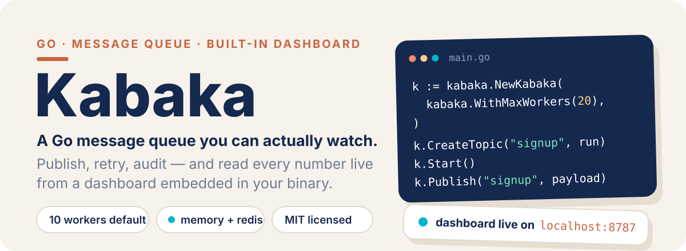
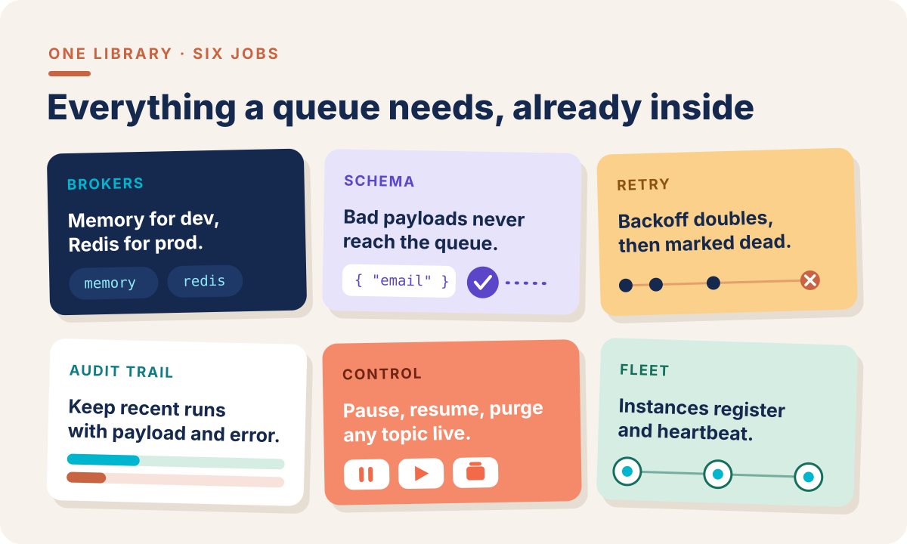
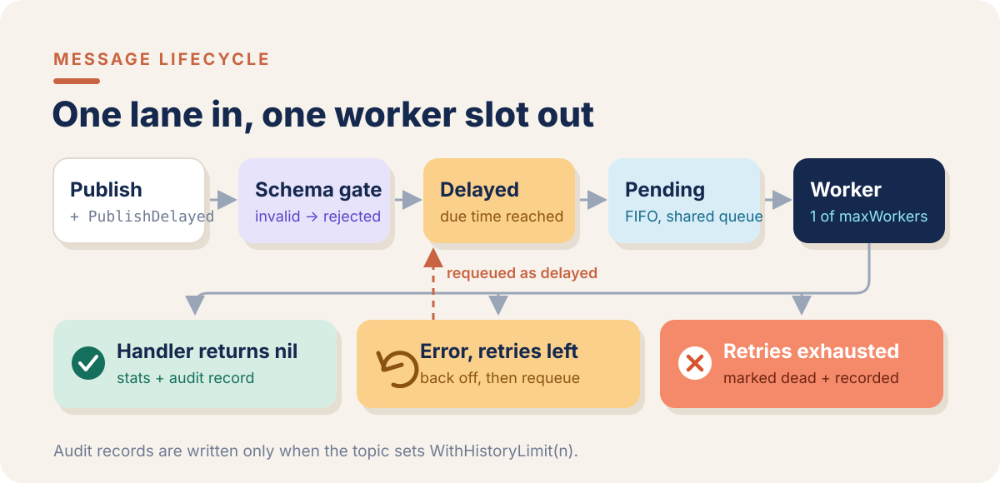
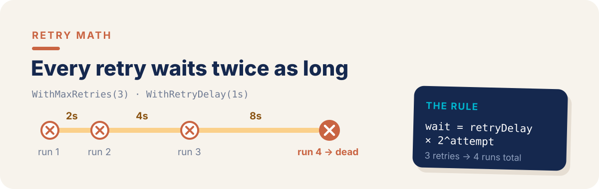
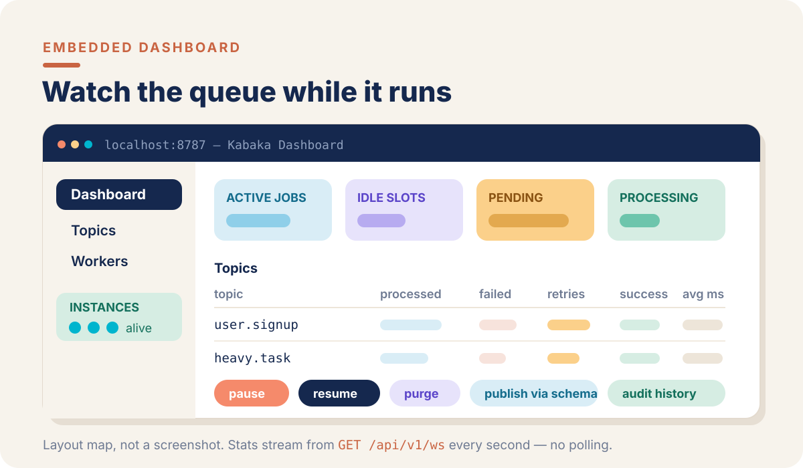

<p align="center">
  
</p>

<p align="center">
  <a href="https://pkg.go.dev/github.com/weichen-lin/kabaka"></a>
  
  
  
</p>

## Install

```bash
go get github.com/weichen-lin/kabaka
```

## Quick start

```go
package main

import (
	"context"
	"fmt"

	"github.com/weichen-lin/kabaka"
	"github.com/weichen-lin/kabaka/broker"
	"github.com/weichen-lin/kabaka/dashboard"
)

func main() {
	// 1. Initialize Kabaka
	k := kabaka.NewKabaka(
		kabaka.WithMaxWorkers(10),
		kabaka.WithBroker(broker.NewMemoryBroker()), // Use Redis for production
	)

	// 2. Define a Topic with Schema Validation
	userSchema := `{
		"type": "object",
		"required": ["user_id", "email"],
		"properties": {
			"user_id": { "type": "string" },
			"email": { "type": "string", "format": "email" }
		}
	}`

	k.CreateTopic("user.signup", func(ctx context.Context, msg *broker.Message) error {
		fmt.Printf("Processing signup for: %s\n", string(msg.Value))
		return nil
	},
		kabaka.WithSchema(userSchema),
		kabaka.WithMaxRetries(5),
		kabaka.WithHistoryLimit(100),
	)

	// 3. Start Processing
	k.Start()
	defer k.Close()

	// 4. Start the Dashboard
	dashboard.StartEmbeddedAsync(k, "0.0.0.0:8787")

	// 5. Publish Messages
	k.Publish("user.signup", []byte(`{"user_id": "USR-001", "email": "dev@example.com"}`))

	// Keep the process running
	select {}
}
```

Open <http://localhost:8787> and watch the topic move.

<p align="center">
  
</p>

## How a message travels

<p align="center">
  
</p>

A published payload is validated against the topic schema before it ever reaches the queue. Delayed messages wait in a scheduler (a min-heap in memory, a sorted set in Redis) until their due time, then join the shared pending queue. The dispatcher hands each message to a worker slot from a semaphore sized by `WithMaxWorkers`, so concurrency is capped across **all** topics, not per topic.

<p align="center">
  
</p>

```text
wait before retry = retryDelay × 2^attempt   (attempt starts at 1)
```

With `WithMaxRetries(3)` and `WithRetryDelay(1s)` a permanently failing job runs 4 times, waiting 2s, 4s and 8s in between, and is then marked `dead`. If the topic sets `WithHistoryLimit(n)`, the final outcome — payload, status, attempts, duration and error — is stored in the audit trail.

## Dashboard

<p align="center">
  
</p>

The dashboard is compiled into your binary with `go:embed` — no extra service, no separate deployment.

- **System overview**: active jobs, idle worker slots, and queue depth.
- **Topic registry**: processed, failed, retries, success rate, average duration.
- **Queue status**: live pending / delayed / processing counts per topic.
- **Interactive management**: pause, resume and purge a topic from the UI.
- **Schema forms**: publish messages through a form generated from your JSON Schema.
- **Audit trail viewer**: browse recent runs with payload, status, duration and error.
- **Instances**: every running instance registered in Redis, with its host and worker count.
- **WebSocket updates**: stats are pushed on an interval, not polled.

```go
// Non-blocking (recommended)
srv, err := dashboard.StartEmbeddedAsync(k, "0.0.0.0:8787")

// Blocking
dashboard.StartEmbedded(k, "0.0.0.0:8787")

// Blocking, with custom options
dashboard.StartEmbeddedWithOptions(k, "0.0.0.0:8787",
    dashboard.WithAuth("my-secret-token"),
    dashboard.WithStatsInterval(2*time.Second),
    dashboard.WithCORS("https://example.com"),
    dashboard.WithTitle("My App Dashboard"),
)
```

| Dashboard option       | Description                     | Default              |
| ---------------------- | ------------------------------- | -------------------- |
| `WithAuth(token)`      | Enable API token authentication | disabled             |
| `WithStatsInterval(d)` | Stats broadcast interval        | `1s`                 |
| `WithCORS(origins...)` | Allowed CORS origins            | `*`                  |
| `WithTitle(title)`     | Dashboard page title            | `"Kabaka Dashboard"` |

### REST API

| Method | Path                            | Description                   |
| ------ | ------------------------------- | ----------------------------- |
| `GET`  | `/api/v1/health`                | Health check                  |
| `GET`  | `/api/v1/stats`                 | System-wide metrics           |
| `GET`  | `/api/v1/topics`                | List all topics               |
| `GET`  | `/api/v1/topics/{name}`         | Topic detail                  |
| `GET`  | `/api/v1/topics/{name}/history` | Audit trail                   |
| `POST` | `/api/v1/topics/{name}/pause`   | Pause a topic                 |
| `POST` | `/api/v1/topics/{name}/resume`  | Resume a topic                |
| `POST` | `/api/v1/topics/{name}/purge`   | Purge queues                  |
| `POST` | `/api/v1/topics/{name}/publish` | Manually publish a message    |
| `GET`  | `/api/v1/instances`             | Instances registered in Redis |
| `GET`  | `/api/v1/ws`                    | WebSocket for real-time stats |

## Brokers

### In-Memory

For local development and CI. Delayed messages live in a min-heap; background goroutines move due messages into the queue and requeue processing entries that went stale.

```go
kabaka.WithBroker(broker.NewMemoryBroker())
```

### Redis

For production. Queue operations run as Lua scripts (reliable-queue pattern), delayed messages use a sorted set, and every instance registers itself with a heartbeat so the dashboard can list the fleet.

```go
// addr, password, db
kabaka.WithBroker(broker.NewRedisBroker("localhost:6379", "", 0))

// Or bring your own client (cluster options, TLS, custom pool)
kabaka.WithBroker(broker.NewRedisBrokerWithClient(client, broker.RedisBrokerOptions{
    Prefix: "kabaka:",
}))
```

## Configuration

Passed to `kabaka.NewKabaka(...)`:

| Option                 | Description                              | Default         |
| ---------------------- | ---------------------------------------- | --------------- |
| `WithBroker(b)`        | Set the message broker (Memory or Redis) | In-Memory       |
| `WithMaxWorkers(n)`    | Maximum concurrent worker goroutines     | `10`            |
| `WithLogger(l)`        | Custom logger implementation             | `DefaultLogger` |
| `WithBrokerTimeout(d)` | Timeout for broker operations            | `2s`            |
| `WithMetaCacheTTL(d)`  | TTL for topic metadata cache entries     | `5m`            |

Passed to `k.CreateTopic(...)`:

| Option                  | Description                                           | Default |
| ----------------------- | ----------------------------------------------------- | ------- |
| `WithMaxRetries(n)`     | Maximum retry attempts before marking as dead         | `3`     |
| `WithRetryDelay(d)`     | Base delay for exponential backoff retries            | `1s`    |
| `WithProcessTimeout(d)` | Execution timeout for the handler function            | `30s`   |
| `WithHistoryLimit(n)`   | Number of audit records to keep (0 = disabled)        | `0`     |
| `WithSchema(v)`         | JSON Schema for payload validation (string or struct) | none    |

## Core API

```go
// Topic management
k.CreateTopic(name, handler, options...)

// Publishing
k.Publish(topicName, payload)
k.PublishDelayed(topicName, payload, delay)

// Topic control
k.SetTopicPaused(name, true)   // pause consumption
k.SetTopicPaused(name, false)  // resume consumption
k.PurgeTopic(internalName)     // drop pending + delayed messages

// Audit trail
k.GetTopicHistory(name, limit)

// Metrics and topology
k.GetStats()
k.GetInstances()  // nil unless the broker supports the instance registry
k.BrokerType()    // "memory" or "redis"

// Lifecycle
k.Start()
k.Close()         // waits for in-flight jobs, then closes the broker
```

## Development

```bash
make up      # start a Valkey/Redis container
make test    # go test ./...
make dash    # build the frontend and run the example app with the dashboard
```

## License

MIT. See [`LICENSE`](./LICENSE).
